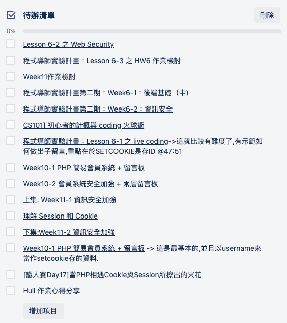

## 十一到十五週心得

呼～又到了複習週  

這一次到上一次複習週, 花了比較長的時間, 一方面是資訊量比以前都還要大, 二方面對於後端領域完全沒有觸碰過, 看到可以跟上進度的同學由衷佩服, 記得老師說過, 可以跟著自己的進度走, 所以在第11週跟不上進度後, 我就放棄跟上進度的念頭, 改為理解自己的所學為主,穩紮穩打再進行下一週. 

上一次複習週的時候老師有提過, 可以要每一次交完功課就寫下心得, 但是每次交完功課只想要休息, 有一種氣數用盡的感覺, 頂多就是寫下作業的解題心得. 

## Week11 
### 課程體驗:
這一週主要是要理解加密和hash的差異, 和session和cookie. 因為課程比較少,所以印象比較不深刻 

### 作業部份:  
第一題沒有想像中難, 也理解資料庫不能存明碼的原因,覺得需要這樣做的原因很直覺. 

第二題我卡了非常久, 我一直沒辦法理解『下次再發 Request 來，就會把通行證 ID 一起帶上來
』,這句話是什麼意思?

想說這是不是和session有關?  
所以上網google了下用法, 但是又看到老師在Learning System說不要用session語法, 然後我心裡又有一個疑問, 用session好像不會用到user_certificate table, session不是把資料存在server端的記憶體嗎? 為什麼還要存在資料庫哩? 

跑去看同學的code, 看到同學在register的時候先亂數產生一組隨機數之後我才知道這的確和session有關, 只是老師要我們做的是cookie_based_session的作法(這是看了淺談三部曲之一提到的名詞)

### 總結:
經過這兩三週, 好不容易才把作業交出來, 但是coding的部份還要加強, 自己雖然看得懂, 但是要稍微想一下. 

## Week12: 
### 課程體驗:

這一週是卡最久的一週, 我記得這一週挺混亂的, 待辦清單一大堆(底下每一個連結都是課程內容), 有些是重複的觀念
例如上一週提到的Cookie和Session, 或是hash, 有些是新的,例如XSS/Sql Injection/CSRF/OWASP等等, 我想是因為這個資安領域我完全沒有觸碰過,所以花了很多時間理解和筆記. 

### 作業部分:
1. 全部改為prepare statement, 其實我一開始小卡, 覺得語法不直覺,現在看起來很自然.

2. 重點就是第二題的子留言, 一開始做的時候,本來想說要在create一個table, 但是我又做不太出來, 因為我不知道子留言的id和主留言是要怎麼關聯再一起,卡了兩天吧, 實在沒辦法, 我還是來學習老師的寫法,看了恍然大悟,原來還有這種寫法,我想這就是實務經驗太少了.

3. 這個作業也學到了拆分檔案, 11週的時候看同學的code, 覺得分成這樣也太棒惹,不會一直看到重複的程式碼, 結果有看到老師的示範, 才知道可以這樣做, 雖然我的index.php還是又雜又亂, 但是把一些check_token的機制拆出來,還是讓程式碼更易懂了些.

### 總結:
也是經過這兩三週, 好不容易才把作業交出來,而且也只完成了最基本的
作業要求, coding的部份還要加強, 自己雖然看得懂, 但是有時還要稍微想一下.

## Week13

### 課程體驗: 
因為之前有買了六角的課程,所以jQuery已經認識它一段時間了,因此課程部分沒有琢磨太久. 我就用兩個晚上的時間, 把我認為在六角值得再看一遍的課程, 在大略看過一遍而已.

BootStrap 我也有在六角買課程,把我認為重要的內容看了三個晚上,到現在也沒看完,等我之後離職要全力求職有時間再來看了. 

Fetch和Promise的部分,聽第一次我覺得蠻好的懂的, 但是現在看了下筆記我怎麼又不太懂了,看來沒真懂, 之後有遇到再來複習了. 

### 作業部分: 
第一二題我都覺得還好,第三題本來想要不看範例,自己試試看,因為這樣才夠深刻

結果上網google老半天,我果斷放棄,因為根本無從下筆,我實在搞不清楚, ajax和這和這份作業有什麼關係, ajax不就是拿來串api的,串api需要網址啊? 沒網址是要怎麼串.

後面又去複習了下所學, ajax其實就是任何非同步可以和server交換資料的方法的通稱, 包含但不限於WEB API串接,和server拿資料也叫做ajax,所以重點在於,我要怎麼輸出資料給前端了. 

再來就是實作session機制了, 我自己寫了個心得, 來看和之前cookie_base_session的做法是否一致,如果不一致那是哪邊不一樣了. 覺得$_SESSION的做法簡單很多....
              
### 總結: 
這一週發現自己對於API/ajax/網路基礎架構方面, 不知道是忘記了還是觀念沒有搞懂,所以複習週會以這邊的加強為主.

## Week14 

### 課程體驗: 
資料庫蠻博大精深的, 這一週的課程主要是讓我瞭解到原來資料庫不只CRUD,還有其他內容. 但是可能實務上比較容易碰的到,所以就寫把筆記寫好, 等將來被用到的時候拿來看. 

### 作業部分: 

就是依樣畫葫蘆影片的內容, AWS太複雜我放棄, 看同學寫的GCP很詳細,但是我想說用最簡單的方式弄就好了,只是想要跑一下自己架站是什麼滋味, 所以就是用老師上課教的Digital Ocean. 

中間一堆問題,本來想要在slack上發問,但是又怕破梗,想說這樣剝奪其他同學的google能力(我都把問題寫好了等著發出去了..), 所以先參考在進度前面同學們的每日心得,看有什麼端倪,或是有什麼相關的文章可以瀏覽, 但是都沒有,我只好硬著頭皮自己想辦法解, 解到後面自己解掉,自己也寫了篇心得放在issue中, 如果有同學看到,希望對他有所幫助. 

後來和老師討論的問題就是不要用子網路遮罩的方式,直接修改A record, 這個也解決掉了, 並透過fileZilla連線到主機, 這樣之後要修改檔案把裡面的檔案置換下就好了.

### 總結: 
成就感滿滿的一週, 結果朋友們真的每天在上面留言, 不小心成為大家的小天地, 也讓我會去思考要怎麼繼續把留言板優化下去

## Week15 

這一週複習週, 幾乎沒有寫code, 就是在加強基礎觀念
1. 紙條三部曲重看了一遍
2. api,ajax重新認識並在看了下課程和文章
3. session/cookie文章閱讀
4. 把跟著小明一起搞懂技術名詞：MVC、SPA 與 SSR在看過一次,最有感的就是講到MPA和SPA那邊!!
5. 把留言板部分改成RWD,在手機上也可以瀏覽.
6. 沒聽的物件導向, 在這一週聽完並撰寫筆記(物件導向第一次只聽得懂class和instance, 現在除了static沒辦法掌握,其他大概知道在幹嘛,但是只有知道在幹嘛,不太會用)

在複習的過程中, 印象比較深刻的, 是老師在NET201有用node.js示範簡易的server寫法(標題是:實作一個超簡易 HTTP Server), 當時我說真的我看不懂,只覺得程式碼好多好複雜, 現在看起來其實蠻直覺的. 

也把老師的『前端後端基礎測試』做了一遍, 老實講再按發送前我確認我的答案好幾次, 但是只有最後一題有問題, 其他都跟老師的解答差不多, 整個信心大增！

## 最後的總結

隨著課程慢慢結束,突然有點不捨,自己生活的重心也都放在這裡了,很喜歡看同學的每日分享,豐富了我這個無聊的上班下班兩點一線的生活,自己平常上班休息的時候都去圖書館看課程,閱讀技術文章,摘錄老師文章中的重點,並試著寫出自己了解的心得筆記. 

我還記得有一個禮拜天本來想說寫完功課出去放風一下,結果完全不知道要去哪? 所以又折騰了好久才騎摩托車到處亂晃, 出門前還跟自己說作業七七八八了,趕快去看看外面的世界吧,但是回到家還是拿了一本”深入淺出JavaScript”.....

看了下之後的課程大綱, 要進入前端中階和框架的部分: 
*  SASS沒有用過,但之前有用過codekit, 大概有點概念, 應該也需要一點時間理解和實作

*  再來就是JavaScript那些你一直搞不懂的地方,這部分讓我想到之前在ptt上大家狂推的課程[JavaScript全攻略: 克服JS的奇怪部分](https://www.udemy.com/javascriptjs/)

* gulp和webpack, 有在零基礎的小明要如何成為前端工程師？看過這些名詞....但還不是很懂, 需要實做看看

* 再來就是前後端框架了, 前端後端我都想學學看,也很期待這些系列課程, 現在沒想說要走前端還是後端, 但是老師有說後端比較常用到物件導向, 我有點怕自己沒辦法跟上,到時候再說吧.

* Final project 比較想要做個電商網站, 可以練習串金流的, 但是等離職有空再來慢慢想就好了. 

這一週的複習大概就是這樣了, 也祝福老師之後的歐洲旅行順利！！
