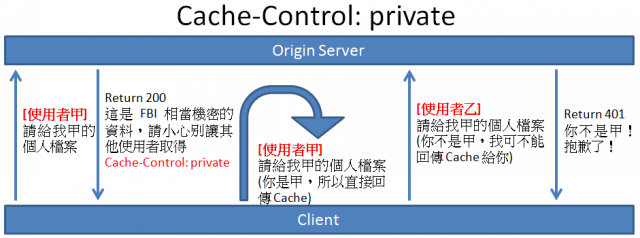
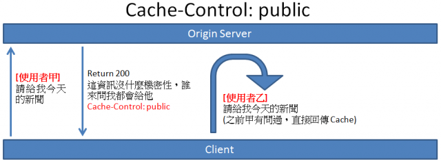

## CSS 預處理器是什麼？我們可以不用它嗎？
可以, CSS預處理器就是可以用這個工具寫成巢狀結構的css, 並透過此工具轉譯成可以網頁可以渲染的正常版面CSS. 
## 請舉出任何一個跟 HTTP Cache 有關的 Header 並說明其作用。

除了有在文章分享中提及的`Cache-Control: max-age=30`這個放在response header 以外, 在mdn也提及了不少client端和server端可以用的header

主要介紹用在response header中的`private`和`public`

1. `Cache-Control: private` : 這個情境會用在敏感資料的處理時,通常只開放給單一使用者快取, 因此在關閉瀏覽器或是切換作業系統使用者的過程,這個快取就會被刪除. 


2. `Cache-Control: public`: 剛好跟 private 相反, 這種策略的 Cache 是可以讓其他使用者共用的,即使具備關聯的 HTTP 認證, 甚至回應狀態碼無法正常快取, 回應也可以供使用者快取, 在大多數情況下，「public」並不是必要項目, 此`header`通常用在比較公開的資料



> 參考資料
1. [Cache-control](https://developer.mozilla.org/zh-CN/docs/Web/HTTP/Headers/Cache-Control)
2. [HTTP 快取](https://developers.google.com/web/fundamentals/performance/optimizing-content-efficiency/http-caching?hl=zh-tw)

## Stack 跟 Queue 的差別是什麼？

- Stack, 先進後出, 就像去麥當勞拿餐盤, 服務員先放在用餐區的餐盤, 反而是最後一個被拿取(因為先放的餐盤被疊在最底下), 而疊在最上面的餐盤會先被消費者使用. 

- Queue, 先進先出, 就像去排隊, 第一個排隊的人, 可以先進場, 晚到的人還是可以進場, 但是要等前面的人都進場後,才輪到晚到的人. 

## 請去查詢資料並解釋 CSS Selector 的權重是如何計算的（不要複製貼上，請自己思考過一遍再自己寫出來，沒有很完整也行）

### 在討論權重如何計算前, 要先了解有哪些選擇器

- ID選擇器(#id):是一個頁面中唯一的值,並且在名稱前方加上`#`符號 

---
- 類選擇器(.className): 指定的樣式名稱.

- 屬性選擇器: 在使用`input[value="text"]`或是使用具有`href`屬性的`a`元素,可寫成`a[href="www.google.com.tw"]` 

- 偽類選擇器: 前面加上一個`:`,例如`:hover`

---
- 元素選擇器(tag):前面不會加上任何`#`或是`.`的符號,也是最常用且最基本的選擇器,例如:`<div>`,`<body>`,`<p>`, 

- 偽元素選擇器: 前面加上兩個`::`, 例如:`::after`,清除浮動常用到, 代表我要放在某一個`<div>`的最末位

| 名稱 | 符號 | 是否為元素 | 是否出現在DOM  | 作用   | 
| -------- | -------- | -------- | -------- | -------- | 
|  偽類(Pseudo-classes) | : | 不是元素 |  不會出現在DOM |  用於定義元素的特殊狀態|
|  偽元素(Pseudo-elements) | :: | 是元素  | 會出現在DOM  |  用於選擇元素的指定部分|

- 子選擇器(E > F): 其中E為父元素, F為子元素. 其中E>F表示為在E選擇器下的所有子元素F. 

例如: `<div> > content`

- 後代選擇器(E F): 其中E為父元素, F為子元素. 但是這影響範圍更深遠, 不僅會影響到F元素, 則F元素之後代孫元素也會被選中. 

例如: `<div> > .content`

- 相鄰選擇器 (E + F): 再有同樣的父輩元素底下, F元素在E元素後面, 而且相鄰. 

例如: `<div> ~ .content`


### 權重的計算規則

0. `!important`: 不推薦使用`!important`
1. `Style=""`(行內選擇), 代表權值為`1000`, 通常這是寫在HTML的文件中,但是也會被`!important`覆蓋
2. `#id選擇器`, 代表權值為`0100`
3. 類選擇器, 偽類選擇器(:hover), 屬性選擇器 : 代表權值為`0010`
4. 元素選擇器(`<div>`),偽元素選擇器(`::after`):代表權值為`0001`
5. 子選擇器、相鄰選擇器等的。如`>`、`+`符號,權值為`0000`

### 權重規則總結:
1. 無論多少個class組成的選擇器,也沒有一個ID選擇器的權重高. 同理, 無論多少個ID選擇器,也比不上一個行內權重高
> 可以想像在幽遊白書裡面, 一群B級怪物永遠打不過A級, A級永遠打不贏S級, 所以權重的比較是建立在雙方要處於同一個等級, 例如B級對B級

2. 如果多個權重不同的選擇器作用在同一元素上, 權重值高的css規則生效
```
.test #test{ } // id 100+class 10=110;
.test #test span{} // id 100+class 10+span 1=111;
.test #test .sonClass{} // id 100+class 10+class 10=120; //生效
```

3. 後寫的樣式會蓋掉前面寫的樣式
(以下為例,box的背景會由藍色改為粉紅色)

```html
<div id="wrapper">
    <div class="box">
       
  </div>
</div>
```
```css
.box{
  width:100px;
  height:100px;
  background-color:blue;
}

.box{
    background-color:pink;
}
```
4. 權重相同時,與元素距離近的選擇器生效
```
    #content h1 { // css樣式表中
      padding: 5px;
    }
    <style type="text/css">
      #content h1 { // 離html更近,所以生效
        padding: 10px;
      }
    </style>
```

> 參考資料
1. [CSS選擇器的權重計算](https://www.itread01.com/p/641109.html)
2. [Specificity Calculator](http://specificity.keegan.st/)
3. [你對CSS權重真的足夠了解嗎？](https://juejin.im/post/5afa98bf51882542c832e5ec)