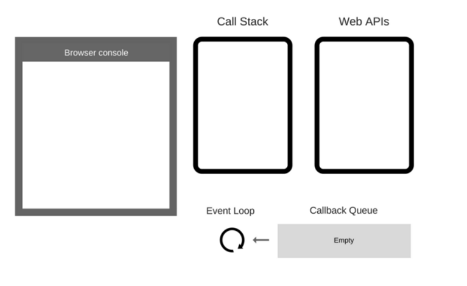

## hw1：Event Loop

**這題的答案是1=>3=>5=>2=>4**


Javascript 是一個單執行緒 (Single Thread)且非同步 (async) 的程式語言

所謂單執行緒，就是在同一時間只能執行一個任務，因此任務多的時候，要排隊

可以想像成 JavaScript 只能跑 single thread，但瀏覽器可以跑 multiple thread，所以會利用 Event Loop 機制去幫助 JavaScript 執行任務。

**Event Loop 運作模式就是不斷得去監測 Call Stack & Callback Queue**

#### Event Loop 的監測順序：

先來看張圖


1. 看 Call Stack 是否有東西
2. 看 Callback Queue 是否有東西,如果 Call Stack 為空，且 Callback Queue 有東西,將 Callback Queue 的東西移到 Call Stack
並回到步驟 (1.)

---
在此題的範例中

```javaScript
console.log(1)
setTimeout(() => {
    console.log(2)
}, 0)
console.log(3)
setTimeout(() => {
    console.log(4)
}, 0)
console.log(5)
```
步驟如下:

#### Round 1: console.log(1)

- `console.log(1)`被放入到Call Stack中

| Call Stack | Web API | Callback Queue | console 結果 |
| --- | --- | --- | --- |
| console.log(1) |  |  | |
| main() |  |  | |

- 執行`console.log(1)`, Call Stack pop off. 

| Call Stack | Web API | Callback Queue | console 結果 |
| --- | --- | --- | --- |
| main() |  |  | 1 |

#### Round 2: setTimeout(() => {console.log(2)},0)

- `setTimeout` 丟進 Call Stack

| Call Stack | Web API | Callback Queue | console 結果 |
| --- | --- | --- | --- |
| setTimout (( ) => {console.log(2)}, 0) |  |  | 1 |
| main() |  |  | |

- 因為`setTimeout`是非同步函式, 執行後把他放入`WEB API`

| Call Stack | Web API | Callback Queue | console 結果 |
| --- | --- | --- | --- |
| main() | Timer (( ) => {console.log(2)}, 0) |  | 1 |

- 因為等待的時間只有0秒, 所以直接把他丟進`Callback Queue`

| Call Stack | Web API | Callback Queue | console 結果 |
| --- | --- | --- | --- |
| main() |  | Timer (( ) => {console.log(2)}, 0) | 1 |

#### Round 3: `console.log(3)`

- `console.log(3)`被放入到Call Stack中

| Call Stack | Web API | Callback Queue | console 結果 |
| --- | --- | --- | --- |
| console.log(3)|  |  | 1 |
| main() |  | Timer (( ) => {console.log(2)}, 0) |  |


- 執行`console.log(3)`, Call Stack pop off. 

| Call Stack | Web API | Callback Queue | console 結果 |
| --- | --- | --- | --- |
| |  | | 1|
| main() |  | Timer (( ) => {console.log(2)}, 0) | 3 |

#### Round 4: 跟Round2 基本流程一樣, 所以更新如下

| Call Stack | Web API | Callback Queue | console 結果 |
| --- | --- | --- | --- |
| |  | ()=>console.log(4))| 1|
| main() |  | ()=>console.log(2)) | 3 |

#### Round5 : 跟Round 1基本流程一樣

| Call Stack | Web API | Callback Queue | console 結果 |
| --- | --- | --- | --- |
| |  | | 1 |
| |  | ()=>console.log(4))| 3  |
| main() |  | ()=>console.log(2)) | 5 |

#### Round6: main() 結束, 從Call Stack pop off, 發現Call Stack清空了

| Call Stack | Web API | Callback Queue | console 結果 |
| --- | --- | --- | --- |
| |  | | 1 |
| |  | ()=>console.log(4))| 3  |
| |  | ()=>console.log(2)) | 5 |

#### Round 7 把在Callback Queue中的timer移到Call Stack中

- `console.log(2)`先放到Callback Queue的, 因此把它先放到Call Stack中

| Call Stack | Web API | Callback Queue | console 結果 |
| --- | --- | --- | --- |
|console.log(2) |  | |  |
| |  | | 1 |
| |  | ()=>console.log(4))| 3  |
| |  |  | 5 |

- 執行, 又發現Call Stack清空了

| Call Stack | Web API | Callback Queue | console 結果 |
| --- | --- | --- | --- |
| |  | | 1 |
| |  | | 3|
| |  | ()=>console.log(4))| 5  |
| |  |  | 2 |

#### Round 8同Round 7

| Call Stack | Web API | Callback Queue | console 結果 |
| --- | --- | --- | --- |
| |  | | 1 |
| |  | | 3|
| |  | | 5  |
| |  |  | 2 |
| |  | | 4 |

最後輸出答案
```javaScript
1
3
5
2
4
```
### 可以得知一個結論:
Call Stack 為空才會將 Queue 內的東西轉進 Stack，所以假設 Stack 內一直有東西在跑，那 Queue 內的東西就不會被執行到