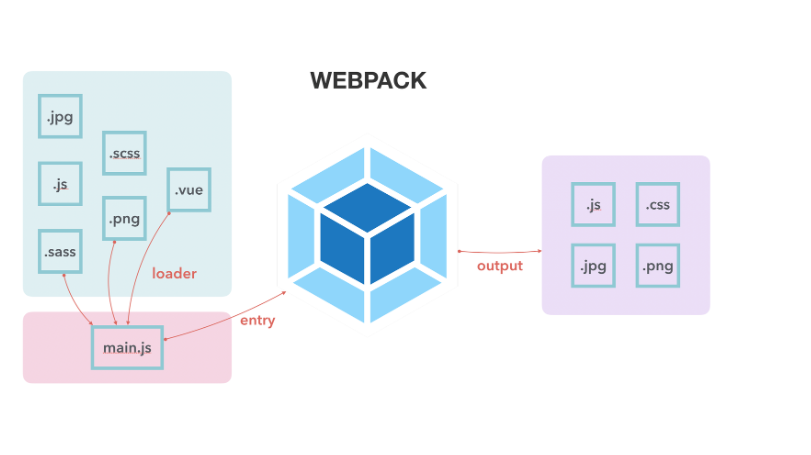
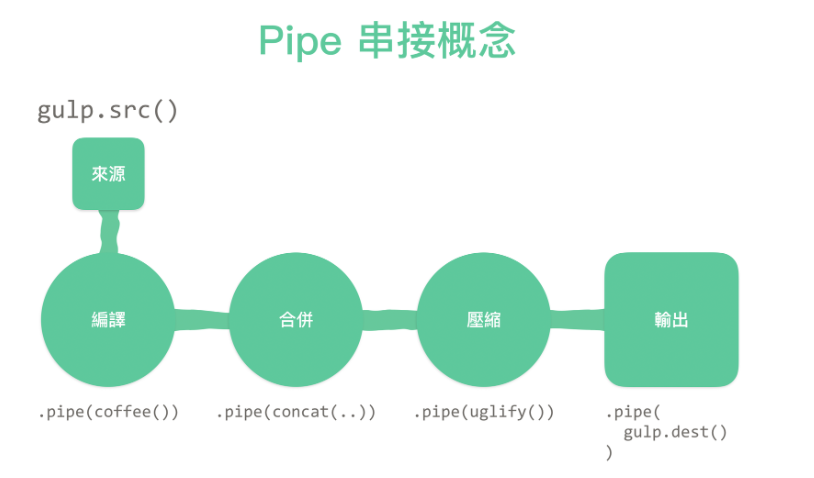

## gulp 跟 webpack 有什麼不一樣？我們可以不用它們嗎？

- Webpack:
  - 是一個模組打包工具
  - 當模組之間相依性極高時, 適合用webpack建構
  - 適合做SPA的應用程式
  - main.js(entry)->webpack(編譯)->產生bundle.js-> .js .css .jpg(output)
 
 

- Gulp: 
  - 簡單來說是一個task runner 
  - 每個task, 可以獨立, 不需進入點, 亦可以手動串連
  - 目的是優化前端開發流程

 

### 可以不用他們嗎?

可以不用這類的工具,但是操作上就會多了很多指令,另外也沒辦法v在瀏覽器上使用類似node.js模組化的概念.

## hw3 把 todo list 這樣改寫，可能會有什麼問題？

效能不好,因為每render一次,就要重新把資料再次渲染一次
若是資料量大的話, 會造成瀏覽器的負擔.較好的作法應該是指渲染修改的地方（ 其他元素位置不動的前提下 ）

## CSS Sprites 與 Data URI 的優缺點是什麼？

### CSS Sprites 簡單介紹

CSS Sprites 是一種圖片處理技巧，其實應該寫成 CSS Image Sprites，翻譯成 CSS 圖片精靈.
原理很簡單，就是把網頁所需要用到的 icon 圖示合併成同一張圖檔，再用 CSS 語法來指定 icon 個別的位置，而不必在 html 架構中一張一張的插入圖片

### CSS Sprites 優點

1. 這個技巧的優點在於可以大幅度縮減伺服器的存取次數，假設一個網頁中有 100 個不同的圖形元件，傳統的方式必須向伺服器發出 100 次 requests 才能取得完整的元件組，透過 CSS Sprites 則可以縮減為 1 次 requests 即完成所有圖形元件的取得，等於是讓伺服器的工作量大幅度降低。

2. 解決了網頁設計師在圖片命名上的困擾，只需對一張集合的圖片上命名就可以了，不需要對每一個小元素進行命名，從而提高了網頁的製作效率。

### CSS Sprites 缺點

1. 只要把網站等比放大，圖片就可能會失真。在現今螢幕解析度提高，以及 RWD 網站盛行的環境下，用 CSS sprite 要面對的可能就是這種失真的小瑕疵。
2. 要把所有的 icon 排在同一張圖片，再自己算出定位，其實很麻煩

 > 參考文章  
[CSS Sprites](https://kknews.cc/code/aaaxopj.html)  
[從 CSS sprite 進化到 SVG sprite](https://muki.tw/tech/css-to-svg-sprite/)

### Data URI 簡單介紹
是一種檔案格式，它主要是由base64編碼之後，以文字的方式來儲其資料.這樣的好處就是不用透過外部的檔案來載入，普遍的情境用在將圖片嵌入網頁上
### Data URI  優點
 瀏覽器不用為了下載圖檔、CSS另外發動HTTP Request，省去原本抓取該圖檔的請求，內嵌成Base64字串是節省頻寬的最佳方案

###  Data URI 使用缺點
1. 因為不是真正的圖檔，所以瀏覽器沒辦法將它快取起來
易讀性差，不像載入圖片時，很清楚檔名相關內容
當檔案資料有變化時，所有內嵌它的網頁都要重新產生編碼
2. 如果沒有使用gzip等網頁壓縮功能，Data URI造成的檔案大小會比原圖檔大33%。加上gzip壓縮後也大約大了2-3%。
3. IE8以上的版本才有支援，且限制大小不可超過32KB
4. Base64會讓內容變大33%
5. CSS會變得很難看。
6. 圖示改變就要重新產生一次Data URI。
7. 在目前的瀏覽器除錯器裡面，它沒辦法給你Data URI的預覽，所以圖片有問題也沒辦法快速地從除錯器裡面看出端倪。

Data URI現在網路上有許多線上網站可以幫你快速地由圖檔轉換，例如 [dataurl.net](https://dataurl.sveinbjorn.org/#about)

### Data URI 和 CSS Sprites的比較

Data URI在這些情況下相對於Sprite有優勢：

1. 針對現代瀏覽器。
2. 不能使用Background-image時。
3. 圖示時常變動。
4. 同一個圖示需要以不同的大小在不同地方顯示。

 > 參考文章  
[Data URI 前端優化](https://medium.com/cubemail88/data-uri-%E5%89%8D%E7%AB%AF%E5%84%AA%E5%8C%96-d83f833e376d)  
[投向Data URI的懷抱！](https://neversaycoding.tumblr.com/post/96379343807/%E6%8A%95%E5%90%91data-uri%E7%9A%84%E6%87%B7%E6%8A%B1)