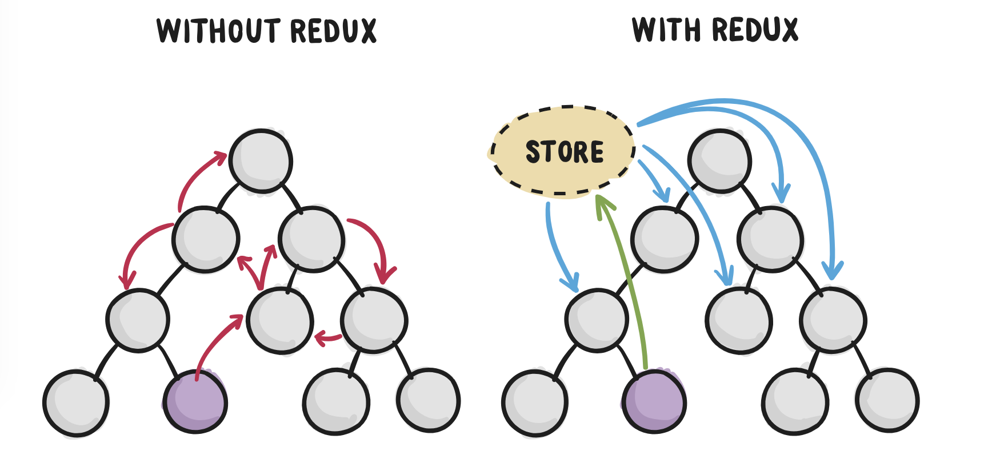

## 為什麼我們需要 Redux？

因為想要透過子元件把`state`傳給子元件, 而不是透過一般父元件傳給子元件的方式. 

若是專案的規模很大,狀態會變得很難管理, `state`都透過父元件一一傳遞給子元件, 不僅會浪費效能, 維護上也會耗費時間. 

所以最好的方法是把`state`放到共同可以存取到的地方, 這個地方`Redux`有給他一個專有名稱, 叫做`store`

## Redux 是什麼？

> “Redux is a predictable state container for JavaScript apps.”

這是官方的定義

核心概念:
1. 單一的狀態樹
2. Action描述改變
3. Reducer 實做改變

ActionTypes: 避免打錯字, 把字串變為變數的地方
Action: 通常都會export pure function出去, 這邊和dispatch做搭配, 會用來定義要操作哪些方法.
Reducer: 這是用來設定state要如何改變的地方, 即改變資料邏輯的地方.
Store: 一群reducer集合再一起會變成`store`, 在redux中只有一個store

這時候要通過`connect`要把互相影響的兩個`component`做串接, 這兩個`component`對於`store`
來說就像是傳給`props`一樣, 但彼此還是有`state`和`props`的區別. 
影響其他子元件的透過`mapDispatchToProps`把想要的參數傳給被影響的子元件. 
被影響的子元件則是透過`mapStateToProps`來接收參數

`mapStateToProps` 是串redux的state 。
`mapDispatchToProps` 是串redux的action。

### 總結:
Reducer是一個狀態容器, 他管理整個應用的狀態. 無法直接透過setter改變資料, 必須透過action和reducer來得到新資料

## Single Page Application 是什麼？有哪些頁面一定要用這個架構去設計嗎？

就是一頁瀏覽, 不管做什麼操作都不會換頁還是在同一個頁面上,是在前端去做渲染(client side render), 這樣的好處是頁面之間跳轉很流暢, 不像一般網頁會有白屏出現.

因為透過`AJAX`技術, 當前端發request給server時, server回傳資料以後, client端再用JavaScript把畫面render出來.

在舊式的網頁中, 都是透過後端去做渲染, 這是server side render, 所以在更改畫面時, 透過網址會跳轉到那個頁面. 
在server端解析完後, 直接在前面把畫面顯示出來. 

client side render 和 server side render 最大的區別就是
當你啟用右鍵 -> 檢視原始碼，會發現幾乎是空的.

因為對於前者, 我們是在執行期間, 動態去跟和後端伺服器拿到資料. 
在動態產生看到的元素. 這些元素原本就不存在在`index.html`中.

### client side render 優點: 
- 前後端分離, 後端專注資料輸出, 前端利用ajax從後端拿到資料, 並用JavaScript動態產生內容.

- 前後端部署可以分開,對前端來說是一個靜態檔案, 沒有流量的問題. 如果有一天server掛掉, 還是可以呈現畫面, 只是看不到資料而已, 但是如果用server side render 會整個畫面都渲染不出來. 

### client side render 缺點: 
client side render固然很美好, 但是會造成前端複雜化.
原本後端是依照路由來渲染出畫面, 但是後端現在只專注在資料輸出
因此把路由的工作交給前端來進行. 

該怎麼做? 因為前端只是一個靜態檔案, 可以透過hash, 例如說`https://example.com/index.html#about`，前端再去解析後面的字串。

## 有哪些頁面一定要用這個架構去設計嗎？

音樂播放網站或是各大串流媒體, 或是想要增進使用者體驗的網站. 
